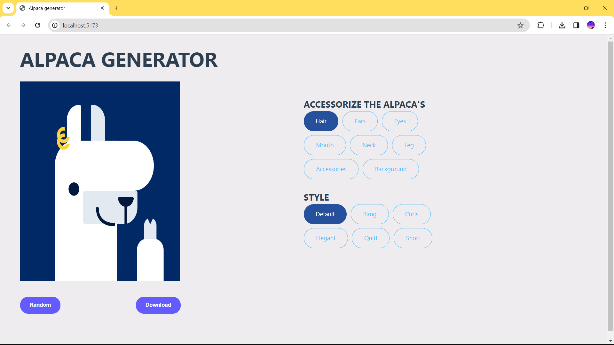

# Introduction
We love alpacas! It's our mascot, and we'd love for you to have your own alpaca profile photo. With that said, this project is not just about alpacas. Allowing users to generate and download avatars are common in many interactive websites.
## Tech/framework used
Built with Vue3

## Screenshots and demo

## Installation
Step 1: Install vue in here https://vuejs.org/guide/quick-start.html.\n
Step 2: Download this code.\n
Step 3: Open it in VS code or another source code editor.\n
Step 4: In terminal, write 'npm install' and press 'Enter' to install dependences.\n
Step 5: Then, write 'npm run dev' to run this project.

